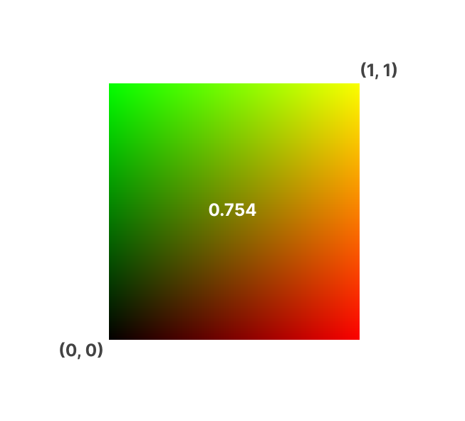
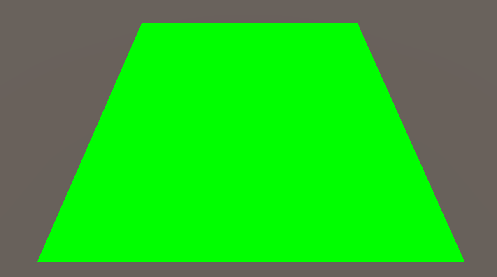

# Shell texturing

Browsing Youtube, I found a [video about Shell Texturing](https://www.youtube.com/watch?v=9dr-tRQzij4) by Acerola, where he explains how difficult is to render and simulate hair, in average, humans have between `90,000` and `150,000` hairs on their head[1], so one must image how geometrically complex would be a physically accurate simulation of hair.

Lo primero que necesitamos es una forma de generar un valor aleatorio para cada coordenada `uv` de una superficie, para esto se utiliza una función de *hash*.

```hlsl
// Thanks to Hugo Elias
float hash(uint n) {
	n = (n << 13U) ^ n;
	n = n * (n * n * 15731U + 0x789221U) + 0x1376312589U;
	
	return float(n & uint(0x7fffffffU)) / float(0x7fffffff);
}
```

Las primeras dos operaciones de la función de hash escapan el alcance de este blog, sin embargo, si analizamos la operación de retorno, podemos observar que se realiza una operación `and` a `n` y `0x7fffffff`, es `2,147,483,647` o `INT_MAX`, es decir, todos sus bits son `1` excepto el bit de signo, el cual es `0` al ser este un número **positivo**

Realizamos la operación para analizar su comportamiento.
```
  0111 1111 1111 1111 1111 1111 1111 1111  // 0x7fffffff
& 1010 1011 1001 1100 1010 1011 1110 0011  // random negative number
‾‾‾‾‾‾‾‾‾‾‾‾‾‾‾‾‾‾‾‾‾‾‾‾‾‾‾‾‾‾‾‾‾‾‾‾‾‾‾‾‾
  0010 1011 1001 1100 1010 1011 1110 0011  // same number but positive
```

Con este ejemplo, podemos concluir que el objetivo de esta operación es convertir cualquier número en positivo.

Ahora que tenemos una función de hash, podemos asignar un valor pseudoaleatorio entre $[0, 1]$ por cada segmento de `uv` dentro de una variable `rand` con el siguiente código.



*Figura 1. valor pseudo-aleatorio $0.754$ en un rango `uv` de $[0, 1]$.*

Tenemos que `rand = valor pseudo-aleatorio`, lo que nos permite crear la siguiente condición: 

```hlsl
if (rand < 0.5) {
    discard;
}
```

lo que descartará todos los pixeles del sector `uv` si la `rand` resulta ser menor que 0.5.



Podemos ver que en este caso, obtuvimos un valor mayor que 0.5, por lo que los pixeles no se descartaron.

Ahora el objetivo es segmentar el quad y obtener más valores `rand`, para lograr esto multiplicaremos las coordenadas `uv` por nuestro primer parámetro, al cual llamaremos `float _Density`, este número escalará `uv`para que así 


## References:

[1]M. Bischoff, “The World’s Simplest Theorem Shows That 8,000 People Globally Have the Same Number of Hairs on Their Head,” Scientific American, Mar. 20, 2023. https://www.scientificamerican.com/article/the-worlds-simplest-theorem-shows-that-8-000-people-globally-have-the-same-number-of-hairs-on-their-head/ (accessed Jun. 13, 2024).
