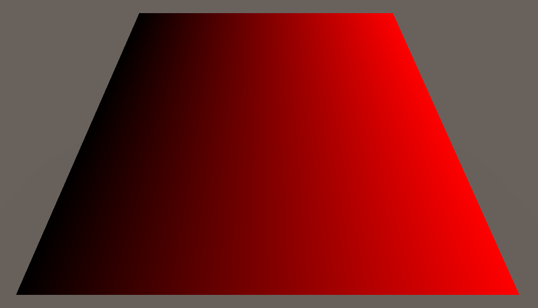
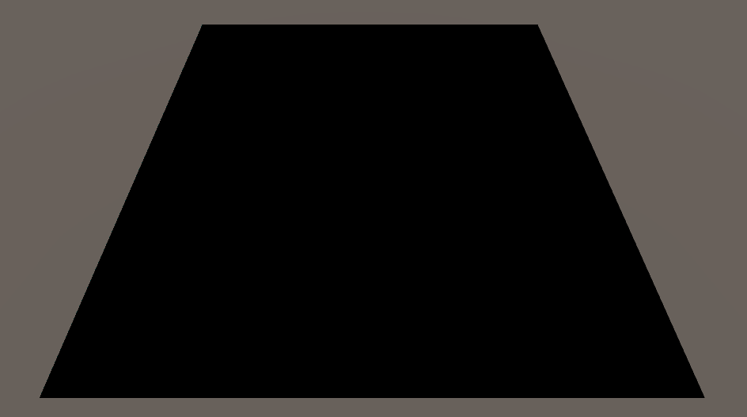
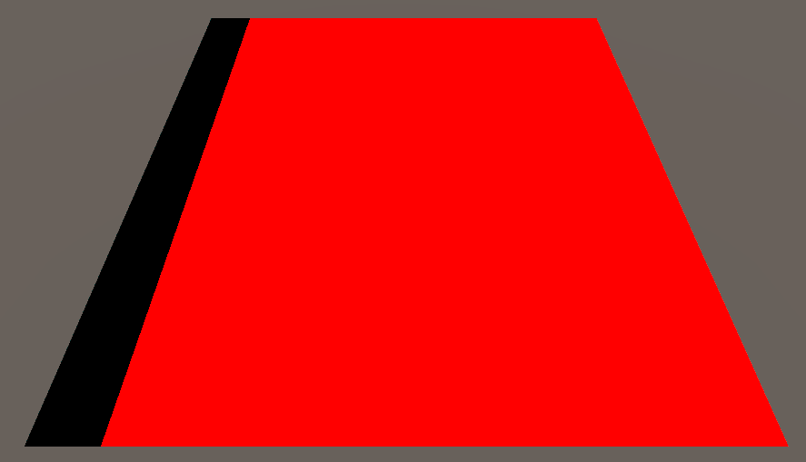
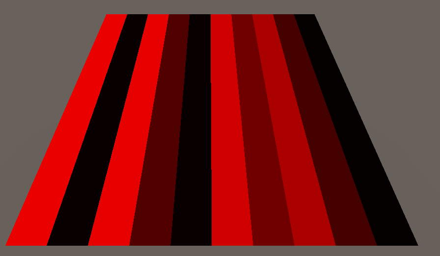
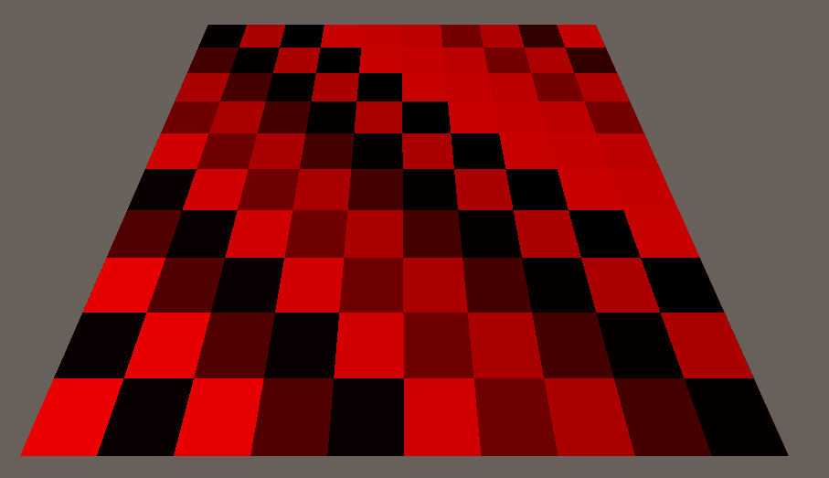
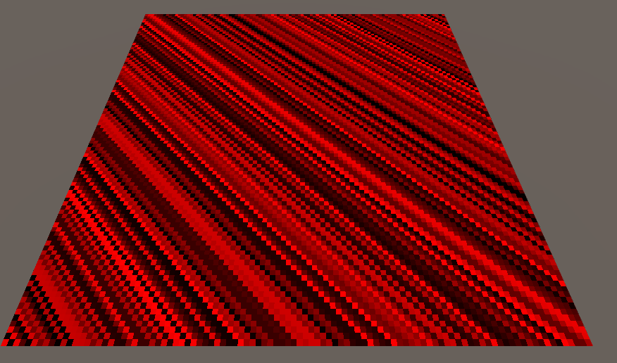
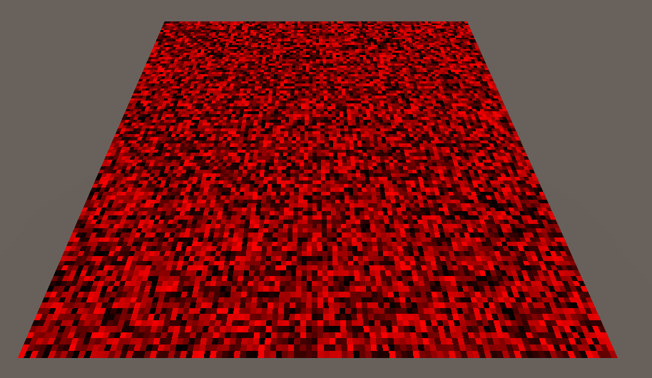

# Shell texturing
---

Browsing Youtube, I found a [video about Shell Texturing](https://www.youtube.com/watch?v=9dr-tRQzij4) by Acerola, where he explains how difficult is to render and simulate hair, in average, humans have between `90,000` and `150,000` hairs on their head^[1], so one must image how geometrically complex would be a physically accurate simulation of hair.

## Hashing
---
Nuestro primer objetivo será generar una grilla de celdas con valores pseudo-aleatorios del $[0, 1]$ sobre la superficie de nuestro mesh.

Para resolver la generación de valores pseudo-aleatorios  podemos utilizar una función de *hash*.

```hlsl
// Thanks to Hugo Elias
float hash(uint n) {
	n = (n << 13u) ^ n;
	n = n * (n * n * 15731u + 0x789221u) + 0x1376312589u;
	
	return float(n & uint(0x7fffffffu)) / float(0x7fffffff);
}
```

Las primeras dos operaciones de la función de hash escapan el alcance de este blog, sin embargo, si analizamos la operación de retorno, podemos observar que se realiza una operación `and (&)` en `n` y `0x7fffffffu`.

`0x7fffffffu` es un número entero con casi todos sus bits en `1`, la única excepción es el bit de signo, el cual es `0` al ser este un número **positivo**.

Realizamos la operación para analizar su comportamiento.
```
  0111 1111 1111 1111 1111 1111 1111 1111  // 0x7fffffffu
& 1010 1011 1001 1100 1010 1011 1110 0011  // random negative number
‾‾‾‾‾‾‾‾‾‾‾‾‾‾‾‾‾‾‾‾‾‾‾‾‾‾‾‾‾‾‾‾‾‾‾‾‾‾‾‾‾
  0010 1011 1001 1100 1010 1011 1110 0011  // same number but positive
```

Con este ejemplo, podemos concluir que el objetivo de esta operación es obtener el valor absoluto de `n`.

Luego, al dividir el valor absoluto de `n` por `0x7fffffffu` (el mayor valor posible que `n` puede tomar), estaremos realizando una **normalización** de `n`, por lo que el dominio de la función `hash` es $(0 \leq n \leq 1)$.

## Generating the grid

---

El objetivo ahora es lograr crear una grilla con celdas que tengan un valor pseudo-aleatorio entre [0, 1] asociado, veremos como realizar esta tarea paso por paso.

Si devolvemos uv.x en el canal rojo del fragment shader obtendremos este output:


// TODO - Figure desc

Luego, dividimos el espacio en valores enteros calculando el `floor()` de `uv.x`, lo cual cual nos otorga el siguiente resultado:


// TODO - Figure desc
Lo cual no es muy interesante... ¡Pero tiene todo el sentido del mundo!, ya que `uv.x` $\in [0, 1]$, `floor(uv.x)` nos devolverá `0` (negro) en todos los pixeles. Para solucionar esto, escalaremos las coordenadas `uv` por un valor que llamaremos `numCells`. 

Veamos cual es el resultado de multiplicar `uv` por `numCells = 10`.


Vemos que ahora $\frac{1}{10}$ de la imagen final es negra, esto es debido a que la franja negra tiene el valor `uv.x = 0`, a su lado, se encuentra una franja roja del mismo ancho y valor `uv.x = 1` y así sucesivamente, como no existe un valor más rojo que `r = 1.0` en colores LDR (Low dynamic range), el efecto no es tan obvio. Sin embargo si ponemos nuestra fórmula como input de hash, la situación será evidente.


¡Ta-da! Recordemos que comprobamos que la función `hash()` nos devuelve un valor $\in [0, 1]$, por lo que la franja negra con el valor `0` que veíamos antes ha sido asociada a un pseudo-aleatorio propio. Vemos que esto ha ocurrido también para `uv.x = 1`, `uv.x = 2`, `uv.x = 3`, y así hasta `uv.x = numCells - 1`.

Sin embargo, nuestras `cells` están algo estiradas verticalmente... debemos agregar el valor `floor(uv.y)` a `floor(uv.x)`, así obtendremos el patrón de grilla que estamos buscando.



Ahora si vemos claramente nuestra grilla, si me lo preguntan a mi diría que se ve muy bien pero claramente tiene un patrón predecible, no hay que olvidar que nuestro objetivo es crear una superficie de celdas con valores pseudo-aleatorios $\in [0,1]$ asociados.

Este problema es aún más evidente si multiplicamos `uv` por `numCells = 100`.



Sin embargo, si multiplicamos `uv.y` por `numCells + 1`, obtenemos:


¿Cómo?, ¿que clase de magia es esa?, ¿Acaso esa multiplicación me apareció en un sueño?. Bueno, la realidad es que se debe a como funciona nuestra fórmula, podemos expresar la creación de la seed como $s(x, y) := x + yt$ donde $t$ es una constante `uint` que podremos ajustar a gusto.

Queremos que la `seed` no se reptia para dos input `x, y`, para esto, debemos analizar que significa que dos `seed` sean iguales expresándo tal igualdad utilizando la definición de $s(x, y)$.

$$x_1 + y_1t = x_2 + y_2t$$

Si restamos $x_2$ en ambos lados y factorizamos por $t$ en el lado derecho nos queda que

$$x_1 - x_2 = t(y_2 - y_1)$$

Ahora, analizando el caso de que $y_1 = y_2$, notamos que

$$x_1 - x_2 = t(y_2 - y_1) = 0 \implies x_1 = x_2$$

Y si $x_1 = x_2$ e $y_1 = y_2$, significa que estamos hablando del mismo punto (x, y), lo cual demuestra la unicidad de un seed en una fila de la grilla.

// TODO - ¿Cómo indexo ecuaciones?

Ya que $y_1, y_2 \in \mathbb{N}$, cuando $y_2 \ne y_1$, tenemos que el **mínimo valor** posible del **lado derecho** de la ecuación[req. index] **es $t$** (en el caso $y_1 = 0, y_2 = 1$).

Ahora que sabemos que $x_1 - x_2 \ge t$, nos viene bien recordar que $x_1, x_2 \le$ `numcells` por lo que *necesariamente* $x_1 - x_2 \le$ `numCells`. Es ahí donde encontramos el punto débil de la igualdad entre 2 `seed`, si forzamos un valor $t >$ `numCells`, romperemos la igualdad definida por $x_1 + y_1t = x_2 + y_2t$. Esto quiere decir que con un valor $t \ge$ `numCells + 1`, es imposible que se repitan las `seed` en nuestra grilla.

## References:

[1]M. Bischoff, “The World’s Simplest Theorem Shows That 8,000 People Globally Have the Same Number of Hairs on Their Head,” Scientific American, Mar. 20, 2023. https://www.scientificamerican.com/article/the-worlds-simplest-theorem-shows-that-8-000-people-globally-have-the-same-number-of-hairs-on-their-head/ (accessed Jun. 13, 2024).
